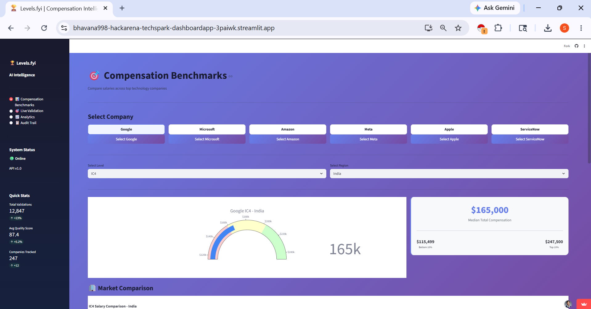
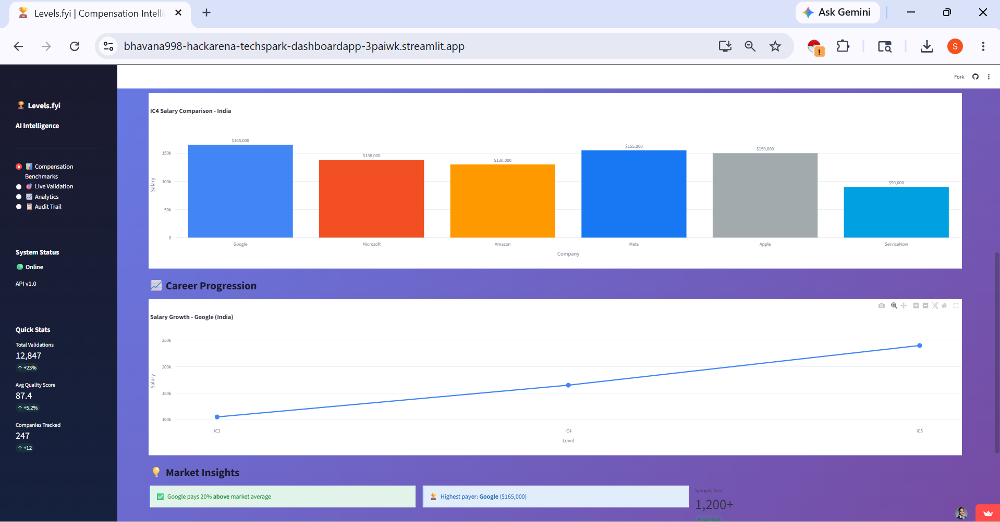

# 🚀 CrowdGuard AI – Intelligent Crowdsourced Data Validation System

<div align="center">


### 🛡️ AI-Powered Crowdsourced Compensation Data Validation Platform

Detect anomalies, spam submissions, inconsistent salary reports, and suspicious patterns using Machine Learning + Rule-Based Intelligence.

</div>

---

# 📌 Problem Statement

Crowdsourced platforms like **Levels.fyi** rely on self-reported compensation data.
However, user-submitted data often contains:

* ❌ Fake salary submissions
* ❌ Spam or bot-generated entries
* ❌ Duplicate reports
* ❌ Invalid compensation structures
* ❌ Unrealistic salary ranges
* ❌ Missing or inconsistent fields

Manual validation becomes impossible at scale.

## ✅ Solution

**CrowdGuard AI** automatically validates salary submissions using:

* AI-driven anomaly detection
* Rule-based consistency checks
* Trust scoring engine
* Duplicate/spam detection
* Quality scoring system
* Real-time validation dashboard

---

# 🌐 Live Demo

## 🔗 Backend API

[https://hackarena-techspark.onrender.com](https://hackarena-techspark.onrender.com)

## 🔗 AI Dashboard

[https://bhavana998-hackarena-techspark-dashboardapp-3paiwk.streamlit.app/](https://bhavana998-hackarena-techspark-dashboardapp-3paiwk.streamlit.app/)

---

# 🧠 Core Features

## ✅ AI-Based Anomaly Detection

Detects:

* Unrealistic compensation values
* Salary-location mismatches
* Experience vs role inconsistencies
* Suspicious compensation spikes
* Outlier detection using ML models

---

## ✅ Rule-Based Validation Engine

Checks:

* Required fields
* Compensation logic
* Base salary vs total compensation
* Location formatting
* Role hierarchy consistency

---

## ✅ Trust Scoring System

Each submission gets:

| Metric            | Description                  |
| ----------------- | ---------------------------- |
| Quality Score     | Overall submission quality   |
| Confidence Score  | Reliability estimation       |
| Risk Level        | Low / Medium / High          |
| Validation Status | Accepted / Review / Rejected |

---

## ✅ Spam & Duplicate Detection

Flags:

* Rapid repeated submissions
* Same IP submissions
* Duplicate salary patterns
* Suspicious timing behavior

---

## ✅ Interactive Dashboard

Visual analytics for:

* Validation statistics
* Outlier detection
* Submission quality distribution
* Risk analysis
* AI prediction insights

---

# 🏗️ System Architecture

```text

                     ┌─────────────────────┐
                     │ User Salary Form    │
                     │ (Levels.fyi Style)  │
                     └──────────┬──────────┘
                                │                               
                                ▼
                    ┌──────────────────────────┐
                    │ FastAPI Validation API   │
                    │ Receives Submission      │
                    └──────────┬───────────────┘
                               │
             ┌─────────────────┴─────────────────┐
             │                                   │
             ▼                                   ▼
 ┌──────────────────────┐           ┌──────────────────────┐
 │ Data Preprocessing   │           │ Metadata Extraction  │
 │ - Missing values     │           │ - IP Address         │
 │ - Data cleaning      │           │ - Timestamp          │
 │ - Type validation    │           │ - User Activity      │
 └──────────┬───────────┘           └──────────┬───────────┘
            │                                  │
            └────────────────┬─────────────────┘
                             ▼
              ┌──────────────────────────────┐
              │ Rule-Based Validation Engine │
              │                              │
              │ ✔ Required field checks      │
              │ ✔ Salary consistency         │
              │ ✔ Experience validation      │
              │ ✔ Role-location validation   │
              └──────────────┬───────────────┘
                             │
                             ▼
               ┌───────────────────────────┐
               │ AI Anomaly Detection      │
               │                           │
               │ • Outlier Detection       │
               │ • Salary Pattern Checks   │
               │ • Suspicious Behaviour    │
               │ • Duplicate Detection     │
               └─────────────┬─────────────┘
                             │
                             ▼
                ┌────────────────────────┐
                │ Trust Scoring Engine   │
                │                        │
                │ Quality Score          │
                │ Confidence Score       │
                │ Risk Level             │
                └────────────┬───────────┘
                             │
                             ▼
                ┌────────────────────────┐
                │ Validation Report      │
                │                        │
                │ ✅ Accepted            |
                │ ⚠ Needs Review         │
                │ 🚨 Rejected            │
                └────────────┬───────────┘
                             │
                             ▼
                ┌────────────────────────┐
                │ Streamlit Dashboard    │
                │                        │
                │ • Analytics            │
                │ • Risk Visualization   │
                │ • Submission Insights  │
                └────────────────────────┘

---

# 🧪 Validation Logic

## 📌 High Quality Submission Rules

A submission is considered high quality if:

✅ Salary is within expected market range

✅ Total compensation ≥ base salary

✅ Required fields are complete

✅ Experience matches role level

✅ Location and company are valid

✅ Submission pattern is non-suspicious

---

# 📊 Sample Validation Examples

| Scenario                               | Detection                     |
| -------------------------------------- | ----------------------------- |
| Entry-level engineer with $850k salary | 🚨 Anomaly Detected           |
| Senior engineer TC lower than base     | ⚠️ Compensation inconsistency |
| Multiple submissions within minutes    | 🚨 Spam Pattern               |
| Missing location/company               | ⚠️ Incomplete Data            |
| Realistic salary submission            | ✅ Accepted                   |

---

# 📸 Dashboard Preview

## 🖥️ Main Dashboard




---

## 📊 Validation Analytics


---

## 🚨 Anomaly Detection Results


---

## 📈 Quality Score Distribution


---

# 🛠️ Tech Stack

| Category        | Technology         |
| --------------- | ------------------ |
| Backend         | FastAPI            |
| Dashboard       | Streamlit          |
| AI/ML           | Scikit-learn       |
| Data Processing | Pandas, NumPy      |
| Visualization   | Plotly, Matplotlib |
| Deployment      | Render             |
| API Testing     | Postman            |

---


# ⚙️ Installation Guide

## 1️⃣ Clone Repository

```bash
git clone https://github.com/Bhavana998/Hackarena-Techspark.git
cd Hackarena-Techspark
```

---

## 2️⃣ Install Dependencies

```bash
pip install -r requirements.txt
```

---

## 3️⃣ Run FastAPI Backend

```bash
uvicorn main:app --reload
```

Backend runs on:

```text
http://127.0.0.1:8000
```

---

## 4️⃣ Run Streamlit Dashboard

```bash
streamlit run app.py
```

Dashboard runs on:

```text
http://localhost:8501
```

---

# 🔍 API Example

## Sample Submission

```json
{
  "role": "Software Engineer",
  "company": "Google",
  "location": "Mountain View",
  "experience": 0,
  "base_salary": 850000,
  "total_compensation": 900000
}
```

---

## Validation Response

```json
{
  "quality_score": 28,
  "confidence_level": "Low",
  "risk_level": "High",
  "issues_detected": [
    "Unrealistic salary for entry-level role",
    "Anomalous compensation pattern"
  ],
  "status": "Flagged for Review"
}
```

---

# 📈  Workflow

```text
Hackarena-Techspark/
│
├── backend/
│   │
│   ├── app/
│   │   ├── api/
│   │   │   ├── routes/
│   │   │   │   ├── validation.py
│   │   │   │   └── health.py
│   │   │   │
│   │   │   └── dependencies/
│   │   │
│   │   ├── core/
│   │   │   ├── config.py
│   │   │   ├── constants.py
│   │   │   └── security.py
│   │   │
│   │   ├── models/
│   │   │   ├── submission_model.py
│   │   │   └── response_model.py
│   │   │
│   │   ├── services/
│   │   │   ├── anomaly_detection.py
│   │   │   ├── trust_scoring.py
│   │   │   ├── duplicate_detection.py
│   │   │   └── validation_engine.py
│   │   │
│   │   ├── validators/
│   │   │   ├── salary_validator.py
│   │   │   ├── consistency_validator.py
│   │   │   └── spam_validator.py
│   │   │
│   │   ├── utils/
│   │   │   ├── preprocessing.py
│   │   │   ├── feature_engineering.py
│   │   │   └── logger.py
│   │   │
│   │   └── main.py
│   │
│   ├── tests/
│   │   ├── test_validation.py
│   │   └── test_api.py
│   │
│   ├── requirements.txt
│   └── Dockerfile
│
├── dashboard/
│   │
│   ├── pages/
│   │   ├── analytics.py
│   │   ├── anomaly_dashboard.py
│   │   └── trust_scores.py
│   │
│   ├── components/
│   │   ├── charts.py
│   │   ├── metrics.py
│   │   └── tables.py
│   │
│   ├── assets/
│   │   ├── dashboard.png
│   │   ├── analytics.png
│   │   ├── anomaly.png
│   │   └── quality.png
│   │
│   └── app.py
│
├── datasets/
│   ├── raw/
│   │   └── salary_submissions.csv
│   │
│   ├── processed/
│   │   └── cleaned_submissions.csv
│   │
│   └── validation_results/
│       └── reports.csv
│
├── notebooks/
│   ├── exploratory_analysis.ipynb
│   └── anomaly_detection_training.ipynb
│
├── docs/
│   ├── architecture_diagram.png
│   ├── api_documentation.md
│   └── workflow.md
│
├── .gitignore
├── README.md
├── requirements.txt
└── docker-compose.yml

Final Validation Report
```

---

# 🚀 Scalability Features

✅ Batch validation support

✅ API-ready architecture

✅ Real-time processing

✅ Microservice-friendly structure

✅ Easy deployment on cloud

✅ Modular validation pipeline

---

# 🧠 Future Enhancements

* 🔥 Deep Learning based fraud detection
* 🔥 User reputation tracking
* 🔥 Real-time monitoring alerts
* 🔥 NLP analysis for company reviews
* 🔥 Advanced behavioral analytics
* 🔥 Blockchain-based verification

---

# 👩‍💻 Team & Contribution

### Developed for HackArena TechSpark Hackathon

Contributions, suggestions, and improvements are welcome.

---

# ⭐ Why This Project Stands Out

✅ Real-world industry problem

✅ AI + Analytics integration

✅ Production-ready architecture

✅ Interactive dashboard

✅ Scalable validation pipeline

✅ Strong business impact

✅ Fraud & spam prevention

---

# 📬 Contact

## 👩‍💻 Developer

setty bhavana

GitHub:

[https://github.com/Bhavana998](https://github.com/Bhavana998)

kavya shri

GitHub:

[https://github.com/Kavyashri217](https://github.com/Kavyashri217)

---

# ⭐ Support

If you found this project useful:

🌟 Star the repository

🍴 Fork the project

📢 Share with others

---

<div align="center">

</div>
